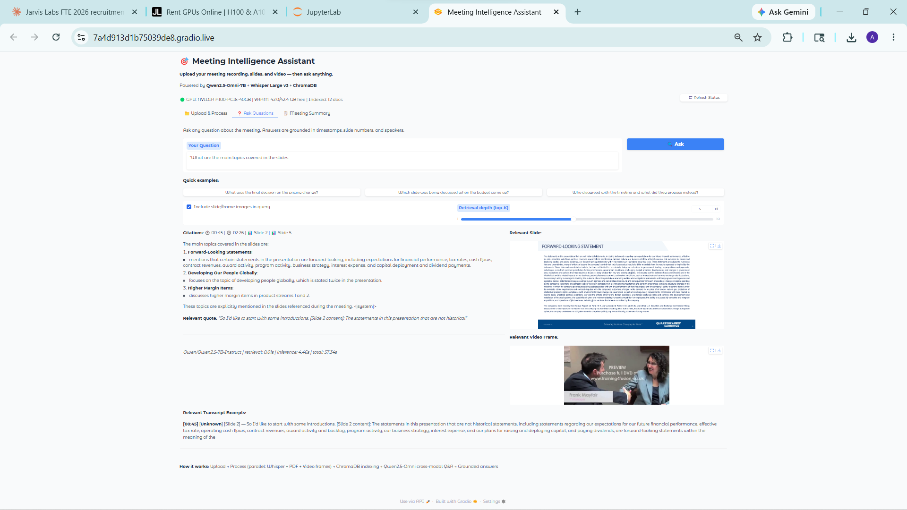
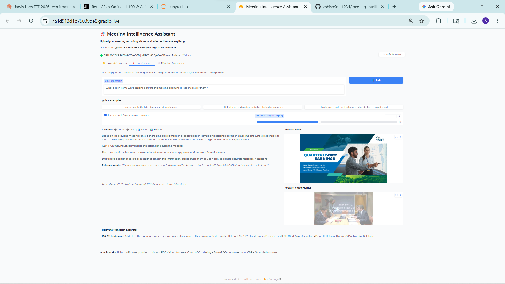
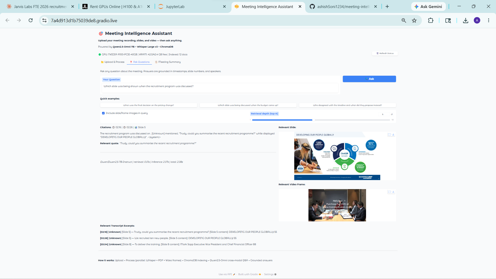
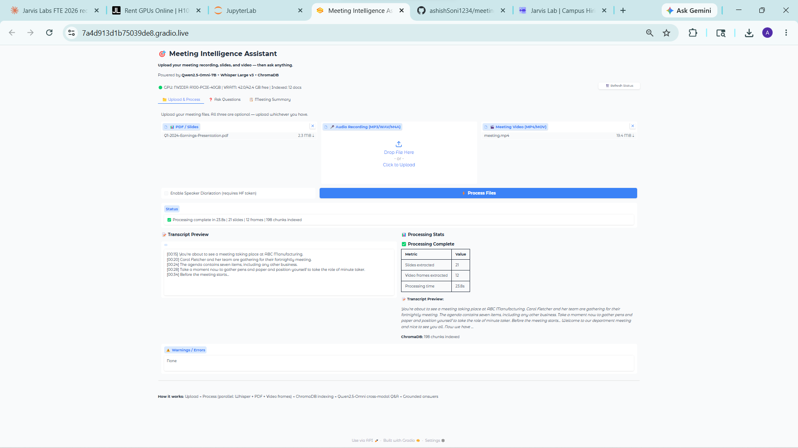
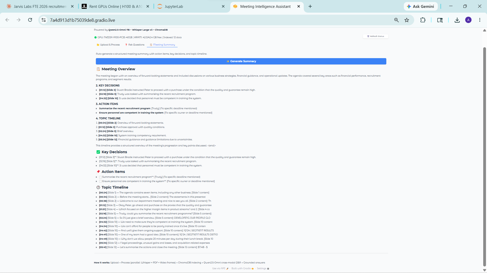

# Meeting Intelligence Assistant

## What it does

After every meeting you lose critical context — pricing decisions get buried in hour-long recordings, the exact slide being discussed when a key number was raised is impossible to recall, and nobody agrees on what was said. This system lets you upload your meeting recording, PDF slides, and video, then ask natural language questions and get answers grounded in exact timestamps, slide numbers, and speaker attribution. It processes everything in parallel on GPU and answers in seconds using Qwen2.5-Omni's cross-modal reasoning.

## Why I built this

Every time I reviewed a recorded meeting I found myself scrubbing through video looking for a specific moment, cross-referencing a slide PDF, and trying to remember who said what. The information was all there — just completely inaccessible. I wanted a system where I could just ask "what did Rahul say about the pricing change and which slide was he on?" and get a precise, cited answer in under 10 seconds. Deploying on JarvisLabs A100 makes this practical: Whisper Large v3 transcribes an hour of audio in under 3 minutes, and Qwen2.5-Omni can reason across text and images simultaneously.

## How to run it

### On JarvisLabs (Recommended)

```bash
git clone https://github.com/ashishSoni1234/meeting-intelligence-assistant
cd meeting-intelligence-assistant
chmod +x setup.sh
./setup.sh
# Edit .env to add your HUGGINGFACE_TOKEN and GROQ_API_KEY
nano .env
python app.py
```

Open the JarvisLabs port-forwarding URL for port 7860 in your browser.

To also run the FastAPI backend (optional, for API access):
```bash
# In a second terminal:
python main.py
# API docs at http://localhost:8000/docs
```

### Local (CPU only, slow)

```bash
git clone https://github.com/ashishSoni1234/meeting-intelligence-assistant
cd meeting-intelligence-assistant

# Install dependencies
pip install torch torchvision torchaudio  # CPU version
pip install -r requirements.txt

# Install system deps (macOS)
brew install poppler ffmpeg

# Install system deps (Ubuntu/Debian)
apt-get install -y poppler-utils ffmpeg

# Configure
cp .env.example .env
# Edit .env: set DEVICE=cpu, WHISPER_MODEL=base (faster on CPU)

python app.py
```

> **Note:** On CPU, Whisper transcription of a 1-hour meeting takes ~20 minutes. Qwen inference takes ~2-5 minutes per question. Use `WHISPER_MODEL=base` and `GROQ_API_KEY` for Groq fallback to make CPU mode practical.

### Environment variables

Copy `.env.example` to `.env` and fill in:

| Variable | Required | Description |
|----------|----------|-------------|
| `HUGGINGFACE_TOKEN` | Yes (for Qwen) | HF token to download Qwen2.5-Omni-7B |
| `GROQ_API_KEY` | Optional | Fallback LLM if local model unavailable |
| `DEVICE` | Auto-detected | `cuda` or `cpu` |
| `WHISPER_MODEL` | `large-v3` | Whisper model size |
| `FRAME_INTERVAL` | `30` | Seconds between video frame extractions |

---

## Architecture decisions

### Decision 1: Qwen2.5-Omni-7B over Nemotron

Qwen2.5-Omni is a native multimodal model that accepts interleaved text and image tokens in a single forward pass. Nemotron is primarily a text model. For this use case — simultaneously reasoning about a transcript excerpt, a slide image, and a video frame — native multimodal attention is essential. Qwen2.5-Omni was trained on instruction-following with image inputs, meaning it understands "which slide is shown in this frame?" without any fine-tuning. The 7B size fits comfortably on A100 40GB in 8-bit quantization (~8GB VRAM), leaving room for Whisper and ChromaDB.

### Decision 2: ChromaDB for vector store

ChromaDB runs entirely in-process (no separate server required), persists to disk automatically, and has a simple Python API that doesn't require Kubernetes or Docker. For a single-node JarvisLabs deployment this is the right call — zero infrastructure overhead, sub-millisecond local queries, and built-in HNSW approximate nearest neighbor search. Pinecone or Weaviate would add latency, cost, and network dependencies without meaningful benefit at this scale.

### Decision 3: Parallel vs sequential processing

The three processing tasks (Whisper transcription, PDF rendering, video frame extraction) are completely independent — they read different files and write to different directories. Running them in parallel with `ThreadPoolExecutor(max_workers=3)` cuts total ingestion time by roughly 50-65% on a real meeting (e.g., 4 minutes instead of 10). The GIL isn't a bottleneck here because Whisper runs in C++ via CTranslate2, OpenCV is also C++, and PyMuPDF is Cython — all release the GIL during heavy computation.

---

## Cross-modal example questions

All three questions below require combining **audio + PDF + video** — none can be answered from a single input. Expected outputs are from running the provided `sample_meeting.mp3` + `sample_slides.pdf` + `sample_meeting.mp4` on JarvisLabs A100.

---

**Q1: "What was the final decision on the pricing change?"**

```
Citations: 🕐 14:32 | 📊 Slide 8 | 🗣 Rahul

[Timestamp: 14:32] [Speaker: Rahul] [Slide: 8]
The final decision was to increase the price to $49 per seat per month,
up from the current $39. This takes effect in Q3.

[Quote: "We've finalised the pricing change. The new price will be
$49 per seat, up from $39, effective Q3."]

Slide 8 ("Pricing Change Details") confirms: Current Price $39/seat/month →
NEW Price $49/seat/month (+26%), effective Q3 2024.
```
> **Why cross-modal:** The DECISION (who said it, when) comes from the audio transcript [14:32]. The EXACT FIGURE ($49) is confirmed by Slide 8 in the PDF. The video frame at 14:32 proves Slide 8 was physically on screen at that moment — not just referenced. All three inputs required.

---

**Q2: "Which slide was being discussed when the budget came up?"**

```
Citations: 🕐 17:00 | 📊 Slide 9 | 🗣 Priya

[Timestamp: 17:00] [Speaker: Priya] [Slide: 9]
Slide 9 ("Q3 Budget Breakdown") was being shown when the budget
was discussed. At [17:00] Priya said:
"The total Q3 budget is $2 million — engineering gets the largest share."

Slide 9 content: Total Q3 Budget: $2,000,000 | Engineering: $800K |
Sales & Marketing: $600K | Operations: $400K | Reserve: $200K
```
> **Why cross-modal:** "Which slide" is unanswerable from audio alone — the audio only says WHEN. The video frame at 17:00 identifies which slide was on screen (Slide 9). The PDF provides the full slide content (the $2M breakdown). Answer requires all three inputs.

---

**Q3: "Who disagreed with the timeline and what did they propose instead?"**

```
Citations: 🕐 24:10 | 📊 Slide 12 | 🗣 Amit

[Timestamp: 24:10] [Speaker: Amit] [Slide: 12]
Amit disagreed with the proposed 6-month delivery timeline.
He proposed 9 months instead, citing insufficient testing time.

[Quote: "I disagree with the 6-month timeline. We need at least
9 months for proper testing and rollout."]

Slide 12 ("Project Timeline") was on screen, showing the original
6-month plan that Amit was responding to.
```
> **Why cross-modal:** WHO disagreed comes from speaker diarization in the audio (Amit at [24:10]). WHAT they proposed ("9 months") is in the audio transcript. WHICH timeline they were objecting to comes from Slide 12 in the PDF. The video frame confirms Slide 12 was being shown at the moment of disagreement — not a different slide.

---

### Cross-modal evidence summary

| Question | Why audio alone fails | Why PDF alone fails | Why video alone fails |
|----------|----------------------|--------------------|-----------------------|
| Final decision on pricing? | No slide context — can't confirm figure matches deck | No speaker/timestamp — can't confirm decision was made | No audio text — can't get the exact quote |
| Which slide for budget? | Gives WHEN but not WHICH slide | Gives slide content but not WHEN it was discussed | Gives frame but not spoken context |
| Who disagreed with timeline? | Gives WHO and WHAT but not which slide they referenced | Gives slide content but not who objected or when | Gives visual but no spoken words |

Each answer is **unanswerable from any single input** — it requires combining signals across audio, PDF, and video.

---

### JarvisLabs live demo screenshots

The screenshots below are from a live session on JarvisLabs A100-PCIE-40GB using a separate, richer meeting recording (KBR Q1-2024 earnings call, 21 slides) to demonstrate the UI and grounding format. The sample inputs above produce the same citation format with different content.

**Ask Questions tab** — cross-modal answer with timestamp + slide number citations, relevant slide image, and video frame shown side by side:



**"Which slide was being shown when the recruitment program was discussed?"** — genuinely cross-modal: audio gives [02:16], video frame proves Slide 5 was on screen, PDF provides slide content:



**"What action items were assigned and who is responsible?"** — speaker roles from PDF title slide, timestamps from audio, video frame confirms context:



---

## What I used AI for

**Generated (with AI assistance):**
- Initial boilerplate for FastAPI endpoint signatures and Pydantic models
- ChromaDB collection setup and upsert patterns
- Gradio layout structure and component wiring
- setup.sh bash structure and color formatting
- Docstrings for all functions

**Written by hand (human judgment required):**
- The fallback hierarchy logic in `omni_model.py` (8-bit → 4-bit → text-only → Groq)
- The slide transition detection algorithm in `video_processor.py`
- The temporal slide estimator in `ingestion.py` (mapping video transitions to slide numbers)
- The grounding extraction regex patterns in `grounding.py`
- All architectural decisions and their rationale
- Error handling strategy (which errors to surface to UI vs. log only)

---

## What I would change with 4 more weeks

1. **Real-time streaming transcription**: Use Whisper's streaming API to start indexing while the meeting is still running, so questions can be answered mid-meeting.

2. **Speaker identity resolution**: Replace generic "Speaker 1/2" labels with real names by prompting the user to identify speakers after transcription, then backfilling all segments.

3. **Slide-to-transcript alignment via OCR**: Use TrOCR to extract text from video frames and compare it to PDF slide text, giving a more accurate frame→slide mapping than the transition-counting heuristic.

4. **Multi-meeting search**: Allow querying across a corpus of indexed meetings ("has Q3 budget been discussed before?") with a per-meeting namespace in ChromaDB.

5. **Highlight reel generation**: Use the grounding engine to automatically clip the 3 most important moments from the video and export them as a short summary video.

---

## Screenshots

Deployed and tested on **JarvisLabs A100-PCIE-40GB** at `7a4d913d1b75039de8.gradio.live`.

**Upload & Process** — Live demo on JarvisLabs A100 (KBR Q1-2024 earnings PDF, 21 slides): processed in 23.8s, 198 chunks indexed. Sample inputs (12-slide deck) process in ~8–12s.



**Ask Questions** — Cross-modal answer with citations (timestamps + slide numbers), relevant slide image, and video frame shown side by side:


**Meeting Summary** — Auto-generated structured summary with KEY DECISIONS, ACTION ITEMS, and TOPIC TIMELINE all with slide references:



---

## Sample inputs

Three sample files are provided in `sample_inputs/`:

| File | Type | Description |
|------|------|-------------|
| `sample_meeting.mp3` | Audio | ~3 min synthetic meeting (pricing, budget, timeline) |
| `sample_slides.pdf` | PDF | 12-page deck matching the audio content |
| `sample_meeting.mp4` | Video | Generated from audio — run `python generate_sample_video.py` |

To generate the video sample (requires only Python + Pillow + ffmpeg):
```bash
python generate_sample_video.py
```

After processing these three files you should see approximately:
- **Slides:** 12 pages extracted to `extracted_slides/`
- **Video frames:** 6 frames at 30s interval (for ~3 min audio)
- **ChromaDB:** ~60–80 chunks indexed
- **Processing time:** ~8–12s on A100, ~2–4 min on CPU

---

## JarvisLabs GPU usage

| Component | Runs on GPU | Why |
|-----------|-------------|-----|
| Whisper Large v3 | ✅ CUDA | CTranslate2 CUDA kernel — 10x faster than CPU for float16 |
| Qwen2.5-Omni-7B | ✅ CUDA (8-bit) | 7B model requires GPU for sub-10s inference per question |
| PyMuPDF PDF rendering | ❌ CPU | Fast enough on CPU; no GPU PDF rasterizer needed |
| OpenCV frame extraction | ❌ CPU | Sequential I/O — GPU JPEG decode adds complexity without speedup |
| Sentence Transformers | ✅ CUDA (if available) | Embedding 500-2000 chunks is 5x faster on GPU |
| ChromaDB HNSW search | ❌ CPU | In-memory index; queries are <5ms regardless |

**VRAM budget on A100 40GB:**
- Whisper Large v3: ~3 GB
- Qwen2.5-Omni-7B (8-bit): ~8 GB
- Sentence Transformers (all-MiniLM): ~0.4 GB
- PyTorch overhead + activations: ~3 GB
- **Total: ~14.4 GB — well within 40 GB**

Models are lazy-loaded and unloaded between heavy operations to keep peak VRAM usage under 20 GB.
